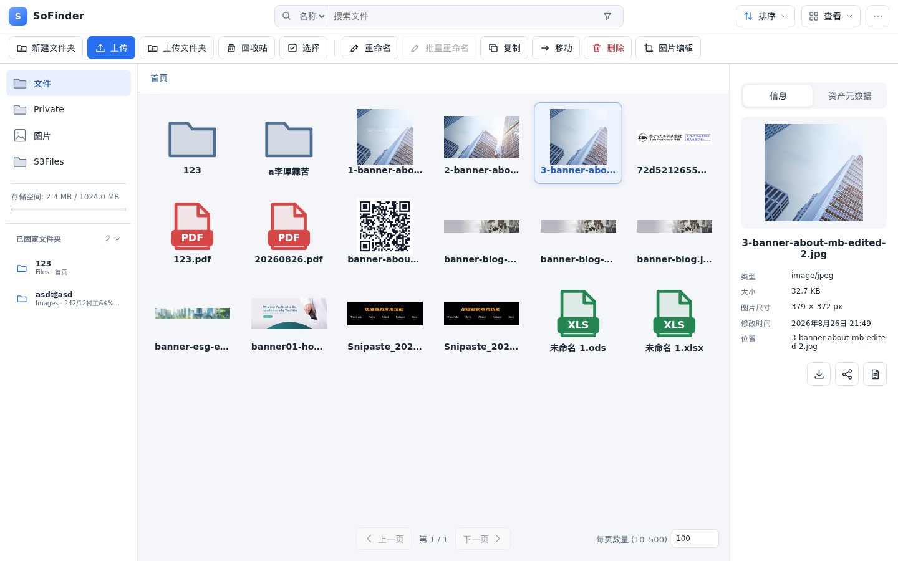
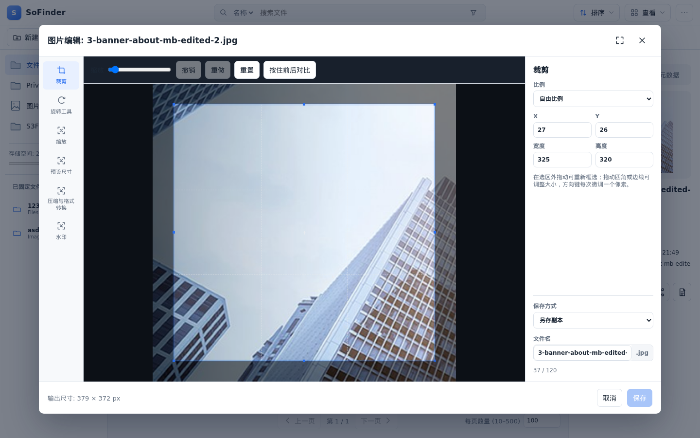
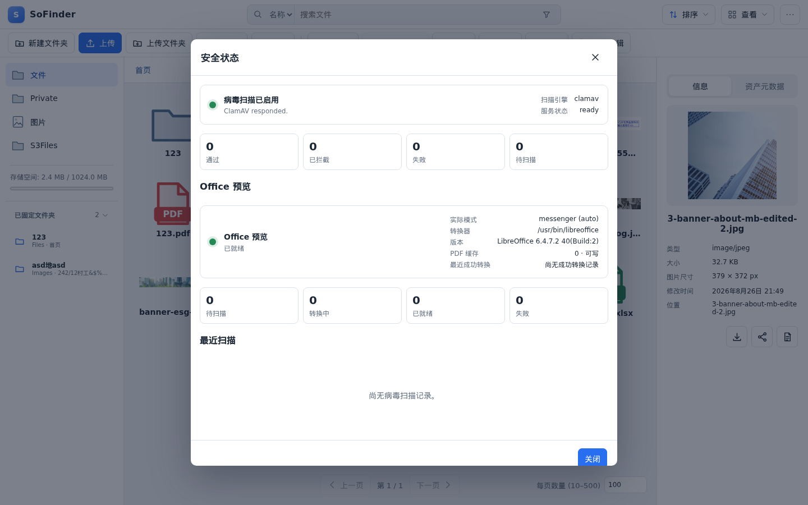

<p align="center">
	<a href="https://sofinder.sohophp.app/zh-CN/">
		
	</a>
</p>

<h1 align="center">SoFinder</h1>

<p align="center"><strong>面向现代 PHP 应用的安全、可扩展文件管理器。</strong></p>

<p align="center">
	<a href="https://github.com/sohophp/sofinder/actions/workflows/ci.yml"></a>
	<a href="https://packagist.org/packages/sohophp/sofinder-symfony"></a>
	<a href="https://packagist.org/packages/sohophp/sofinder-symfony"></a>
	<a href="https://packagist.org/packages/sohophp/sofinder-symfony"></a>
	<a href="LICENSE"></a>
</p>

<p align="center">
	<a href="https://sofinder.sohophp.app/zh-CN/">完整文档</a> ·
	<a href="https://sofinder.sohophp.app/zh-CN/getting-started">快速开始</a> ·
	<a href="https://sofinder.sohophp.app/zh-CN/api-reference">API 参考</a> ·
	<a href="README.md">English</a> ·
	<a href="README.zh-TW.md">繁體中文</a>
</p>

SoFinder 是原创、采 MIT 授权的网页文件管理器，支持 PHP 8.1 至 8.5，包含与框架无关的核心、Symfony 6.4／7.4 Bundle，以及 React 用户界面。PHP 8.1 支持 Core、HTTP、PSR-15、S3 与 Symfony 6.4；Symfony 7.4 和 Laravel 12／13 仍要求 PHP 8.2 或更高版本。

本项目采独立设计，不包含专有文件管理器的程序码、美术、翻译、样式或其他资产。Runtime 相依软件包声明记录于 `THIRD_PARTY_NOTICES.md`。

## 界面预览

<p align="center">
	<a href="docs/public/screenshots/browser.png">
		
	</a>
	<br>
	<sub><strong>文件工作区</strong> — 资源导航、可视化浏览、收藏与文件详情。</sub>
</p>

<table>
	<tr>
		<td width="50%" align="center">
			<a href="docs/public/screenshots/image-editor.png"></a>
			<br><sub><strong>图片编辑器</strong> — 裁剪、旋转、缩放、优化与水印。</sub>
		</td>
		<td width="50%" align="center">
			<a href="docs/public/screenshots/security-status.png"></a>
			<br><sub><strong>运行状态</strong> — 病毒扫描与文档预览就绪状态。</sub>
		</td>
	</tr>
</table>

完整支持的宿主包括 Symfony 6.4／7.4、Laravel 12／13，以及供 Slim 4、Mezzio 3 和
纯 PHP 使用的共享 PSR-15 Bridge；同时保留已测试且不依赖框架 Request／Container
的 Registry 与 `FileManager` headless 入口。准确支持级别见
[`docs/zh-CN/framework-support.md`](docs/zh-CN/framework-support.md)。PHP 7.2
移植只能使用独立包和独立发布线，不进入当前分支或 1.x 依赖图。

普通用户可阅读[文件管理器指南](https://sofinder.sohophp.app/zh-CN/user-guide)、[图片管理](https://sofinder.sohophp.app/zh-CN/image-guide)和[编辑器集成](https://sofinder.sohophp.app/zh-CN/editor-integrations)。开发者请使用[集成指南](https://sofinder.sohophp.app/zh-CN/developer-guide)及 [HTTP API 参考](https://sofinder.sohophp.app/zh-CN/api-reference)。

## 安装

请按宿主框架选择软件包：

| 应用 | Composer 软件包 | 完整步骤 |
| --- | --- | --- |
| Symfony 6.4／7.4 | `sohophp/sofinder-symfony:^1.1` | [Symfony 安装](https://sofinder.sohophp.app/zh-CN/getting-started) |
| Laravel 12／13 | `sohophp/sofinder-laravel:^1.1` | [Laravel 集成](https://sofinder.sohophp.app/zh-CN/framework-integrations#laravel-12-和-13) |
| Slim 4／Mezzio 3／纯 PHP | `sohophp/sofinder-psr15:^1.1` | [PSR-15 集成](https://sofinder.sohophp.app/zh-CN/framework-integrations#共享-psr-15-runtime) |
| 仅领域服务，无浏览器/API | `sohophp/sofinder-core:^1.1` | [Core 集成](https://sofinder.sohophp.app/zh-CN/framework-integrations#仅使用-core-和其他框架) |

### Symfony

新的 Symfony 应用应直接安装稳定 Bridge：

```bash
composer require sohophp/sofinder-symfony:^1.1
```

现有应用可以继续使用兼容 Meta Package `sohophp/sofinder:^1.1`；两个包名都公开相同的
`SohoPHP\SoFinder` namespace。

完整文件站位于 <https://sofinder.sohophp.app/zh-CN/>。注册 `SohoPHP\SoFinder\SoFinderBundle`，导入 `@SoFinderBundle/Resources/config/routes.yaml`，并在 `so_finder.resources` 配置一个或多个资源类型。完整示例请见[简体中文 Symfony 整合](https://sofinder.sohophp.app/zh-CN/symfony)。

已实现功能包含：登录后浏览、搜索、上传、文件夹上传、下载、新建文件夹、重新命名、批量重命名、可恢复删除、自动冲突命名的复制／移动、服务器限制的分页、名称／大小／日期排序、网格／列表视图、多选、具数量上限及逐项结果的批次操作、文件夹树、右键／长按菜单、文本预览、SHA-256、一般／分块上传、图片处理、ZIP 下载、响应式三语界面，以及 CKEditor 4 与适用于 CKEditor 5、TinyMCE、TipTap、Quill、wangEditor、Jodit、普通表单的弹窗 SDK。

资源可配置 byte 配额、必要 Symfony roles 及各操作专用 roles。成功变更会产生结构化 PSR-3 audit log。每位用户的收藏、标签及最近 50 笔记录会通过可替换的 metadata store 原子化保存。

可选资产目录提供稳定 ID、多语言替代文本、标题、共享标签及响应式变体。beta.24 新增有界跨目录资产搜索、可编辑资产属性、由宿主登记的使用关系与删除预检、可撤销私有访问会话及明确的资产迁移命令。

Symfony 整合亦提供经验证的主题配置、tagged plugin descriptor registry、键盘文件导览、可见焦点及屏幕阅读器选取提示。公开扩充契约请见 `docs/plugins.md`。

生产环境可添加同源 plugin UI Action 与 tagged 上传扫描器。可选 PDO／Redis 原子状态、readiness、Prometheus、请求 ID 与 JSON 安全审计支持多节点部署，详见 `docs/production.md` 与 `docs/public/openapi.json`。

图片详细信息会显示实际解码尺寸。图片编辑默认自动命名并另存副本；覆盖必须明确选择。裁剪支持缩放、平移、八方向控制点、比例、键盘／数值微调、恢复／重做及前后比较。浏览器齿轮菜单可控制可选图片工具，旋转和默认尺寸默认关闭。复制与移动可从完整授权资源选取文件夹，服务器仍会执行路径沙箱及 ACL。

每个资源可分别限制 Unicode 文件名长度、文件夹名称长度与文件夹深度。上传、新建文件夹、重新命名、复制及移动都会检查，包含被移动文件夹的完整子树。

上传流程使用私有隔离区、实际 byte 限制、活动内容检查及完整图片解码，再原子发布。SoFinder 也提供继承式路径 ACL、public／proxy delivery、Range／ETag、操作门禁、结构化失败 audit 及私有 30 天回收站。部署时执行 `sofinder:security:audit`；使用外部调度时安排 `sofinder:trash:cleanup` 与 `sofinder:uploads:cleanup`。默认为有上限的 inline 维护，详见[维护模式](https://sofinder.sohophp.app/zh-CN/maintenance)与[安全部署](https://sofinder.sohophp.app/zh-CN/security)。

图片管线支持可嵌入网页的 JPEG、PNG、GIF、WebP、AVIF、BMP、ICO。可用时优先使用 GD，ICO 可可选 Imagick fallback。解码图片上限为五千万像素，编辑会保留原始格式与扩展名。HEIC、HEIF、TIFF 可放在一般文件资源，但不解码、不预览、不编辑。缩略图 Cache 保留 30 天并限制最多 5,000 个文件；ZIP 最多接受 100 个选取根、总计 1,000 个项目及 512 MB。

## 开发

```bash
./scripts/composer.sh install
./scripts/php-bin.sh vendor/bin/phpunit
./scripts/composer.sh phpstan
cd frontend
corepack pnpm install
corepack pnpm build
corepack pnpm test:unit
```

存储扩充契约请见 `docs/storage-adapters.md`；公开 PHP 契约、HTTP 兼容性与版本政策请见 `docs/php-contracts.md`、`docs/http-api.md`、`docs/versioning.md`。图片 Runtime 需求请见[图片格式支持](https://sofinder.sohophp.app/zh-CN/image-formats)。可执行的 Symfony 6.4／7.4 安装示例位于 `examples/symfony`。

S3 兼容对象存储由可选的 `sohophp/sofinder-s3` Composer 软件包提供，使核心
安装不必承担 AWS SDK 相依；可使用私有 proxy delivery，或明确配置公开／CDN
网址。原始码发行内容请见 `packages/sofinder-s3/README.md`。
